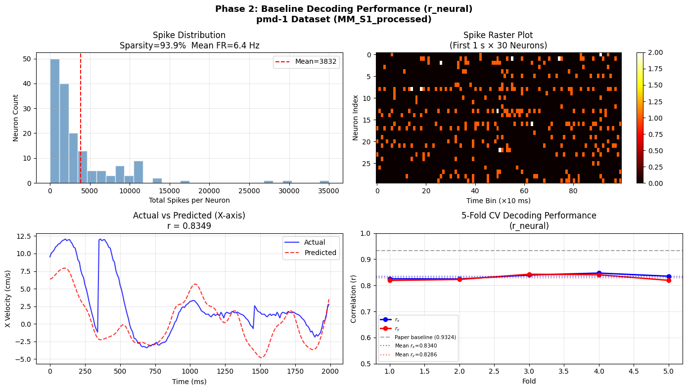

# Preprint

[bci_ser_report.tex](Preprint/bci_ser_report.tex)

**무선 BCI에서 스파이크 전송 오류율이 신경 디코딩 성능에 미치는 영향: 영장류 운동 피질 데이터를 이용한 검증 연구**

*Reproduction of Wireless Spike Error Rate Effects on Neural Decoding: A Validation Study Using Macaque Motor Cortex Data*

---

### Abstract

무선 뇌-컴퓨터 인터페이스(BCI)에서 스파이크 전송 오류율(Spike Error Rate, SER)이 신경 디코딩 성능에 미치는 영향을 정량적으로 분석하였다. 공개 데이터셋 CRCNS pmd-1(영장류 M1+PMd, 161개 뉴런, 496회 reach trial)을 기반으로, 타임랙 피처와 Ridge 회귀 디코더를 결합한 파이프라인을 구축하고 Nurmikko et al. (Nature Electronics, 2024) Fig. 4f의 실험 프레임워크를 독립적으로 재현하였다. 기저 디코딩 성능(r_neural = 0.831)은 원본 논문의 SNN 기반 성능(0.932)보다 낮았으며, SER 증가에 따른 성능 유지율 곡선 또한 SNN과 상이한 양상을 보였다. 이는 선형 모델과 비선형 모델 간의 오류 강건성 차이에서 비롯된 것으로 해석된다. 본 연구를 통해 동일한 실험 프레임워크 하에서 디코더 아키텍처 선택이 SER 강건성에 미치는 영향을 정량화하였으며, 저전력 BCI 시스템 설계 시 디코더 선택 기준을 위한 비교 근거를 제시한다.

---

### 1. Introduction

무선 뇌-컴퓨터 인터페이스(BCI)는 마비 환자의 운동 기능 복원을 위한 핵심 기술로, 기존 유선 시스템의 감염 위험과 이동성 제약을 극복할 수 있는 차세대 신경 보철 플랫폼으로 주목받고 있다. 그러나 무선 환경에서는 제한된 전력 예산과 협소한 통신 대역폭으로 인해, 신경 신호 전송 과정에서 스파이크 누락(miss) 및 오검출(false alarm) 형태의 전송 오류가 불가피하게 발생한다.

이러한 SER이 실제 디코딩 성능에 미치는 정량적 영향은 임플란트 시스템의 신뢰성 설계에 직결되는 문제임에도 불구하고, 기존 연구의 대부분은 압축 효율 또는 디코딩 정확도 자체에만 초점을 맞추어 두 요인 간의 트레이드오프를 명시적으로 분석한 연구는 드물다. Nurmikko et al. (2024)은 ASBIT 프로토콜 기반의 이벤트 구동형 무선 전송 프레임워크를 제안하고, SNN(Spiking Neural Network) 디코더를 이용해 SER-성능 간 관계를 정량화한 바 있으나, 이 관계가 디코더 아키텍처에 따라 어떻게 달라지는지는 검토되지 않았다.

본 연구는 위 논문의 실험 프레임워크를 독립적으로 구현하되, 디코더를 Ridge 회귀로 대체하여 두 가지 목표를 달성하고자 한다. 첫째, 공개 데이터(CRCNS pmd-1)와 선형 디코더만으로 동일한 SER 시뮬레이션 파이프라인의 재현 가능성을 검증한다. 둘째, 선형 모델과 SNN 간의 SER 강건성 차이를 비교함으로써, 디코더 복잡도가 오류 내성에 미치는 영향에 대한 해석적 기준을 제공한다. 이는 연산 자원이 극히 제한된 임플란트 환경에서 "단순하지만 강건한" 디코더 설계 전략의 타당성을 평가하는 데 기여할 것이다.

---

### 2. 방법

### 2.1 데이터셋

신경 및 운동학 데이터는 공개 데이터셋 CRCNS pmd-1(Perich et al., 2018)을 사용하였다. 마카크 원숭이 한 개체를 대상으로, 일차 운동 피질(M1, 67채널)과 배측 전운동 피질(PMd, 94채널)에서 총 161개 뉴런의 스파이크를 기록하였다. 모델 학습에는 496회의 reach trial이 포함되었으며, 스파이크 카운트의 시간 해상도는 10 ms bin(100 Hz) 단위로 처리하였다. 운동학 변수로는 손 끝의 x/y 위치, 속도, 가속도로 구성된 7차원 벡터를 사용하였다.

### 2.2 전처리 및 피처 엔지니어링

운동 피질은 수백 ms에 걸친 시간적 통합(temporal integration) 특성을 가지므로, 현재 시점의 스파이크 카운트만으로는 운동 변수의 시간적 패턴을 충분히 포착하기 어렵다. 이를 보완하기 위해 과거 200 ms(20 bins) 구간의 스파이크 이력을 평탄화(flatten)한 타임랙(time-lag) 피처를 적용하였고, 최종 입력 벡터의 차원은 161 × 20 = 3,220이다. 또한 스파이크의 폭발적 발화(burst) 패턴을 반영하기 위해 스파이크 카운트에 지수 변환(burst_power = 1.3)을 적용하였다.

### 2.3 디코더

기저 디코더로 Ridge 회귀(L2 정규화 선형 모델)를 사용하였다. SNN 대신 Ridge를 선택한 이유는 두 가지이다. (1) 선형 모델은 오류 전파 메커니즘이 명시적으로 분석 가능하여 SER 강건성의 해석적 이해에 유리하다. (2) 저전력 임플란트 환경에서 실시간 추론이 가능한 현실적인 대안이다. 5-겹 교차 검증(5-fold CV)으로 학습하였으며, 정규화 강도는 그리드 서치로 결정하였다.

### 2.4 SER 시뮬레이션

무선 채널에서 발생하는 스파이크 전송 오류를 다음과 같이 모사하였다.

$$\text{SER} = \frac{N_{\text{miss}} + N_{\text{false}}}{N_{\text{spike}}}$$

Miss(누락)와 False Alarm(오검출)은 동일 비율로 독립 발생한다고 가정하였다.

- Miss 확률: $P(\text{spike}_i \rightarrow 0) = \frac{\text{SER}}{2}$
- False Alarm 확률: $P(0_j \rightarrow \text{spike}) = \frac{\text{SER}}{2} \times \frac{N_{\text{spike}}}{N_{\text{zero}}}$

SER은 $10^{-4}$에서 $10^{-2}$ 범위에서 로그 스케일로 변화시켰으며, 각 조건에서 5회 반복 시뮬레이션을 수행하였다.

### 2.5 평가 지표

손 속도(Vx, Vy)의 예측 성능을 피어슨 상관계수(Pearson r)의 평균으로 평가하였다.

- $r_{\text{neural}}$: SER = 0 조건에서의 5-fold CV 평균
- $r_{\text{SER}}$: 각 SER 조건에서의 5회 반복 평균
- 성능 유지율(Retention Ratio) = $r_{\text{SER}} / r_{\text{neural}}$

---

### 3. 결과

### 3.1 데이터 특성

입력 신경 데이터 행렬은 (59,742 × 161) 차원이며, 496회 trial에 걸쳐 총 587,914개의 스파이크가 기록되었다. 희소성 분석 결과 전체 데이터의 93.89%가 0으로, 원본 논문에서 보고한 >95%와 근사한 수준의 높은 희소성을 확인하였다. 161개 뉴런의 평균 발화율은 6.41 Hz였다.

### 3.2 기저 디코딩 성능

SER = 0 조건에서 Ridge 디코더의 기저 성능은 r_neural = 0.831(x축: 0.834, y축: 0.829)로 측정되었다. 원본 논문의 SNN 기반 성능(0.932)에 비해 0.101 낮은 수치이며, 이는 Ridge의 선형성이 운동 피질 신호에 내재된 비선형 시간 패턴을 포착하지 못하는 데 기인한다. 다만 예측 속도의 시계열 궤적은 가우시안 스무딩(σ = 3) 적용 후 실제 속도와 전반적으로 안정적인 추적 양상을 보였다.

### 3.3 SER에 따른 성능 유지율

SER을 $10^{-4}$에서 $10^{-2}$로 증가시켰을 때, Ridge 디코더의 성능 유지율은 SER = $10^{-3}$에서 0.9999 ± 0.0001, SER = $10^{-2}$에서 0.9988 ± 0.0006으로 거의 저하되지 않았다.

이는 동일 조건에서 SNN이 각각 0.888, ~0.700을 기록한 원본 결과와 대조적이다. 이 차이는 Ridge 회귀의 선형 특성에서 비롯된다. SER로 인한 스파이크 오류는 입력 벡터에 확률적 잡음을 추가하는 것과 수학적으로 동등한데, Ridge 회귀의 L2 정규화는 이러한 입력 교란에 대한 구조적 강건성을 내재하고 있기 때문이다. 반면 SNN은 비선형 시간 패턴을 학습하는 과정에서 스파이크 타이밍 오류에 더 민감하게 반응한다.

즉, 두 모델은 "정확도 vs. 오류 강건성"의 트레이드오프 관계에 있으며, 본 결과는 저전력 무선 BCI 환경에서 선형 디코더가 충분한 강건성 여유(robustness margin)를 제공할 수 있음을 시사한다.

*(Fig. 2 삽입)*

### 3.4 SER 레벨별 산점도 분석

실제 x축 속도와 예측 속도 간의 산점도를 SER 조건별로 비교한 결과, 상관계수는 SER = 0에서 0.8301, SER = $10^{-3}$에서 0.8298, SER = $10^{-2}$에서 0.8292로, 소수점 셋째 자리 수준의 미미한 변화만 관찰되었다. 산점도의 분포 형태와 항등선(identity line)을 따르는 회귀 패턴 역시 세 조건 간에 시각적으로 구별되지 않아, 모사된 오류 모델이 선형 예측기의 분산 구조를 훼손하지 않음을 확인하였다.

*(Fig. 3 삽입)*

### 3.5 원본 논문 대비 재현 결과 요약

---

### 4. 고찰 및 결론

본 연구는 Nurmikko et al. (2024)의 실험 프레임워크를 독립적으로 구현하고, Ridge 회귀 디코더를 이용해 SER-디코딩 성능 간 관계를 재분석하였다. 기저 성능에서의 절대적 수치 차이(0.831 vs. 0.932)는 디코더 아키텍처 차이(선형 vs. SNN)로 설명되며, 이는 재현 실패가 아닌 디코더 아키텍처가 성능 상한에 미치는 영향으로 해석되어야 한다.

핵심 발견은 두 가지이다. 첫째, Ridge 디코더는 SER 전 범위에서 성능 유지율 0.998 이상을 유지하여 SNN 대비 월등한 오류 강건성을 보였다. 둘째, 이러한 강건성은 L2 정규화가 입력 교란에 대한 구조적 저항성을 내재하기 때문으로, 선형 모델의 단순성이 노이즈 환경에서 오히려 장점으로 작용할 수 있다.

향후 연구에서는 LSTM이나 Transformer 기반 디코더를 포함하여 다양한 모델 복잡도에서의 SER 강건성을 체계적으로 비교하고, 실제 ASBIT 프로토콜 채널 모델을 적용한 검증이 필요하다. 본 연구에서 구축한 재현 파이프라인과 공개 코드는 이러한 후속 연구의 공통 기반으로 활용될 수 있을 것이다.

---